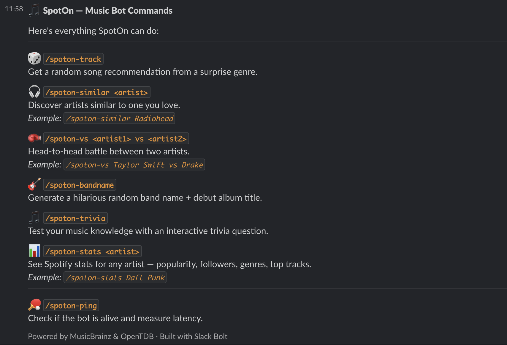

# SpotOn 🎵

SpotOn is a Slack bot that brings music discovery into your workspace via slash commands. Random track picks, artist comparisons, similar artist recommendations, stats, trivia, and band name generation — all without leaving Slack.

It uses the free MusicBrainz API and OpenTDB trivia API, so no paid subscriptions or API keys needed beyond your Slack app tokens.

> Originally this was supposed to use the Spotify API — it's been a while since I'd used it. When I tried to implement the commands, I hit a `403` because Spotify now requires a Premium account even for public catalog data 😭. Ended up rewriting everything with MusicBrainz and honestly it works great.
>
> Making a Slack bot in JavaScript was definitely an experience — I've done one before in Python. Getting the interactive trivia buttons working with Slack's Block Kit was a headache, second only to the artist battle command. So please do try `/spoton-trivia` and `/spoton-vs` — they were the most work! ✌️

---

## Try it

The bot is live and testable in the Hack Club Slack:

**[#bot-testings on Hack Club Slack →](https://app.slack.com/client/E09V59WQY1E/C0B8P5DRDB3)**

Website: [nishanth-s-a.github.io/SpotOn](https://nishanth-s-a.github.io/SpotOn/)

---

## Commands

| Command | Description |
|---|---|
| `/spoton-track` | Get a random track pick from across the MusicBrainz catalogue |
| `/spoton-similar <artist>` | Discover artists similar to one you love |
| `/spoton-vs <artist> vs <artist>` | Head-to-head stat battle between two artists |
| `/spoton-stats <artist>` | Full artist profile — genres, albums, top recordings |
| `/spoton-trivia` | Interactive music trivia with answer buttons |
| `/spoton-bandname` | Generate a random band name + debut album title |
| `/spoton-help` | List all commands |

---

## Screenshot



---

## Running it yourself

**Prerequisites:** Node.js, a Slack app in Socket Mode with slash commands registered.

```bash
git clone https://github.com/nishanth-s-a/SpotOn
cd SpotOn
npm install
```

Create a `.env` file:

```env
SLACK_BOT_TOKEN=xoxb-...
SLACK_APP_TOKEN=xapp-...
```

```bash
node index.js
```

No other API keys needed.

---

## Stack

- [Slack Bolt](https://slack.dev/bolt-js) — bot framework
- [MusicBrainz API](https://musicbrainz.org/doc/MusicBrainz_API) — music data
- [OpenTDB](https://opentdb.com) — trivia questions
- Socket Mode — no public URL required
